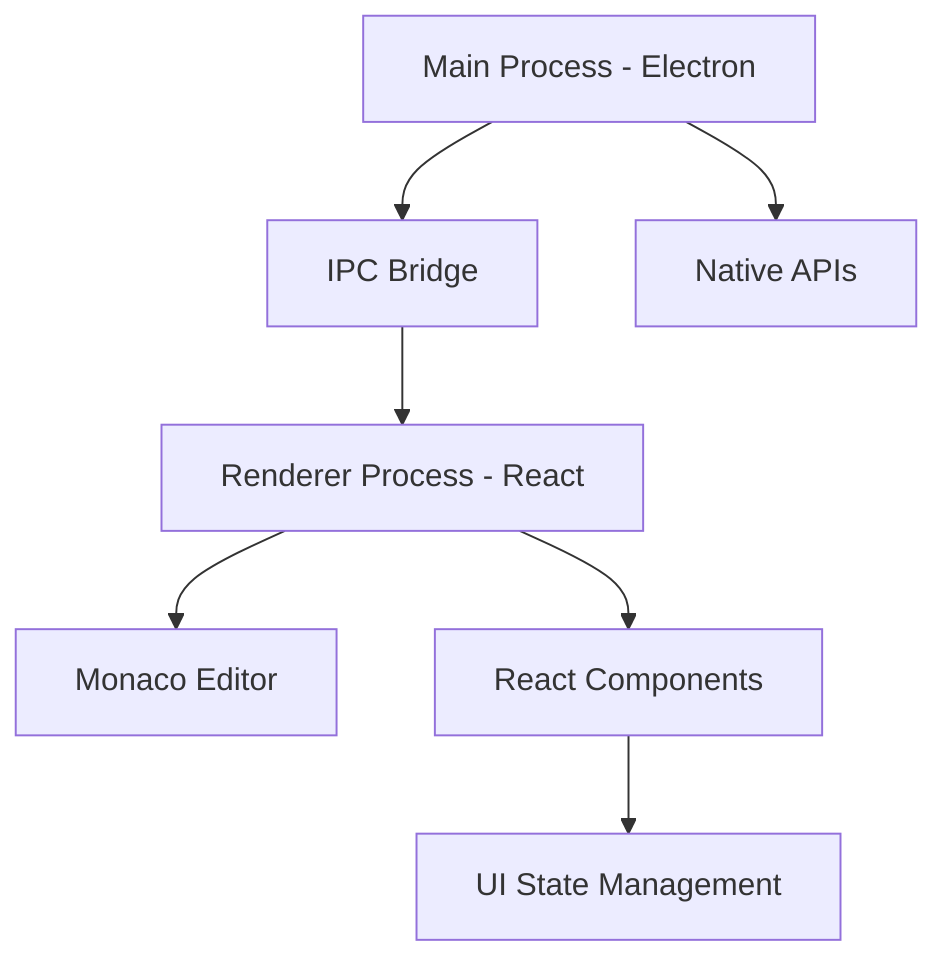

# VS Code Editor

<div align="center">


</div>

## Enterprise Architecture Overview

A sophisticated implementation of a VS Code-like editor leveraging the power of Electron for native desktop capabilities and React.js for robust UI rendering. This project demonstrates advanced patterns in cross-process architecture, state management, and high-performance text editing.

### Core Technology Stack

#### Frontend Architecture
- **React.js 18+**
  - Concurrent Features
  - Server Components
  - Suspense for Data Fetching
  - Custom Hooks Architecture

#### Desktop Runtime
- **Electron Latest**
  - IPC Communication Layer
  - Native API Integration
  - Process Management
  - Security Hardening

#### Development Environment
- **TypeScript 5.0+**
- **Webpack 5**
- **Babel 7**
- **ESLint & Prettier**

## System Architecture

### Process Model


### Component Architecture
```typescript
interface EditorState {
  model: monaco.editor.ITextModel;
  viewState: monaco.editor.ICodeEditorViewState;
  decorations: string[];
}

interface IEditorService {
  createEditor(container: HTMLElement): void;
  updateModel(content: string): void;
  dispose(): void;
}
```

## Core Features Implementation

### 1. Editor Foundation
- **Monaco Integration**
  ```typescript
  class MonacoEditorService implements IEditorService {
    private editor: monaco.editor.IStandaloneCodeEditor;
    
    public createEditor(container: HTMLElement): void {
      this.editor = monaco.editor.create(container, {
        theme: 'vs-dark',
        automaticLayout: true,
        model: null
      });
    }
  }
  ```

### 2. IPC Architecture
- **Secure Channel Implementation**
  ```typescript
  // Preload Script
  contextBridge.exposeInMainWorld('electron', {
    editor: {
      saveFile: (content: string) => ipcRenderer.invoke('editor:save', content),
      openFile: () => ipcRenderer.invoke('editor:open')
    }
  });
  ```

### 3. React Component Structure
- **Editor Component**
  ```typescript
  const Editor: React.FC = () => {
    const editorRef = useRef<monaco.editor.IStandaloneCodeEditor>();
    const [content, setContent] = useState<string>('');

    useEffect(() => {
      // Editor initialization logic
    }, []);

    return (
      <div className="editor-container">
        <div ref={editorRef} className="monaco-editor" />
      </div>
    );
  };
  ```

## Performance Optimizations

### 1. Memory Management
- Efficient disposal of editor instances
- Resource cleanup on component unmount
- Memory leak prevention strategies

### 2. Rendering Optimization
- Virtual DOM optimization
- React.memo for pure components
- useCallback for event handlers

### 3. File Handling
- Streaming for large files
- Worker threads for heavy operations
- Cached file system operations

## Security Implementation

### 1. Process Isolation
```typescript
// Main Process
app.on('ready', () => {
  createWindow({
    webPreferences: {
      nodeIntegration: false,
      contextIsolation: true,
      sandbox: true
    }
  });
});
```

### 2. Content Security
- Strict CSP implementation
- Signed package verification
- Secure update mechanism

## Development Roadmap

### Phase 1: Foundation (Q1 2024)
- [ ] Core editor implementation
- [ ] Basic file operations
- [ ] Theme support
- [ ] Language services

### Phase 2: Extensions (Q2 2024)
- [ ] Extension API
- [ ] Package management
- [ ] Debug protocol
- [ ] Git integration

### Phase 3: Advanced Features (Q3 2024)
- [ ] Remote development
- [ ] Collaboration tools
- [ ] Custom workbench
- [ ] Performance tools

## Contributing

### Development Prerequisites
- Node.js 18+
- npm/yarn
- Git
- C++ Build Tools
- Python 3.x

### Setup Instructions
```bash
# Clone repository
git clone https://github.com/MK-ayaz/vscode-clone.git

# Install dependencies
npm install

# Start development
npm run dev
```

## Technical Documentation

Comprehensive documentation is available in the `/docs` directory:
- [Architecture Guide](docs/ARCHITECTURE.md)
- [API Reference](docs/API.md)
- [Contributing Guide](docs/CONTRIBUTING.md)
- [Security Policy](docs/SECURITY.md)

## Contact & Support

For enterprise inquiries and collaboration:
- 📧 Email: ayaz93872@gmail.com
- 💼 LinkedIn: [Profile](https://linkedin.com/in/your-profile)
- 🌐 Website: [Your Website](https://your-website.com)

## License

This project is proprietary and closed-source. For licensing inquiries, please contact the development team.

---

<div align="center">

**Building the Future of Code Editing**

[GitHub](https://github.com/MK-ayaz) • [Documentation](docs/) • [Issues](issues/)

Made with 💻 by MK-ayaz

</div>
