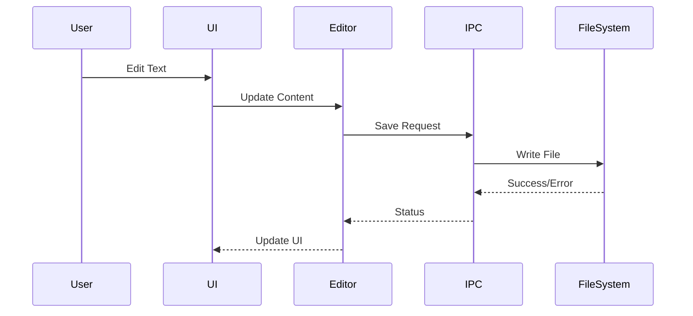

# Architecture Documentation

## System Overview

The VS Code Editor clone is built on a multi-process architecture leveraging Electron and React.js. This document outlines the core architectural decisions and implementation details.

## Process Architecture

### Main Process (Electron)
```
Main Process
├── Application Lifecycle
├── Window Management
├── Native API Access
└── IPC Main Handlers
```

### Renderer Process (React)
```
Renderer Process
├── React Application
│   ├── Components
│   ├── Hooks
│   └── Services
├── Monaco Editor
└── IPC Renderer
```

## Core Components

### 1. Editor Core
- **Monaco Integration**
  - Text Model Management
  - View State Handling
  - Language Services
  - Tokenization

### 2. IPC Layer
```typescript
// IPC Channels
const IPC_CHANNELS = {
  EDITOR: {
    SAVE: 'editor:save',
    OPEN: 'editor:open',
    UPDATE: 'editor:update'
  },
  WINDOW: {
    MAXIMIZE: 'window:maximize',
    MINIMIZE: 'window:minimize'
  }
};
```

### 3. State Management
```typescript
interface EditorState {
  currentFile: string | null;
  content: string;
  language: string;
  isDirty: boolean;
}

interface WorkspaceState {
  openFiles: string[];
  activeFile: string | null;
  fileTree: FileTreeNode[];
}
```

## Data Flow



## Security Architecture

### Process Isolation
```typescript
// Main Process Configuration
{
  webPreferences: {
    nodeIntegration: false,
    contextIsolation: true,
    sandbox: true,
    preload: path.join(__dirname, 'preload.js')
  }
}
```

### IPC Security
- Validated channels
- Type-safe messages
- Error boundaries

## Performance Considerations

### 1. Memory Management
- Editor instance lifecycle
- Resource cleanup
- Memory monitoring

### 2. File Operations
- Streaming large files
- Incremental updates
- Cache management

### 3. UI Performance
- React rendering optimization
- Virtual scrolling
- Lazy loading

## Extension System

### Architecture
```
Extensions
├── API Surface
│   ├── Editor API
│   ├── UI API
│   └── Workspace API
├── Extension Host
└── Extension Process
```

### Loading Process
1. Discovery
2. Validation
3. Sandbox Creation
4. API Injection
5. Activation

## Build and Packaging

### Development Build
```bash
npm run dev
# Starts:
# - Webpack Dev Server (React)
# - Electron in Dev Mode
# - File Watchers
```

### Production Build
```bash
npm run build
# Produces:
# - Optimized React Build
# - Electron Executable
# - Platform Packages
```

## Testing Strategy

### Unit Tests
- Component Testing
- Service Testing
- Utility Testing

### Integration Tests
- IPC Communication
- File Operations
- Extension System

### E2E Tests
- User Workflows
- Cross-platform Behavior
- Performance Metrics

## Future Considerations

### 1. Remote Development
- SSH Connections
- Container Development
- Cloud Workspaces

### 2. AI Integration
- Code Completion
- Refactoring Suggestions
- Documentation Generation

### 3. Collaboration
- Real-time Editing
- Shared Terminals
- Code Reviews

## Version Control Integration

### Git Integration
```typescript
interface GitService {
  status(): Promise<GitStatus>;
  commit(message: string): Promise<void>;
  push(remote: string, branch: string): Promise<void>;
  pull(remote: string, branch: string): Promise<void>;
}
```

## Debugging Architecture

### Debug Adapter Protocol
- Protocol Implementation
- Breakpoint Management
- Variable Inspection

## Error Handling

### Global Error Boundary
```typescript
class ErrorBoundary extends React.Component {
  componentDidCatch(error: Error, errorInfo: React.ErrorInfo) {
    // Log to error reporting service
    // Show user-friendly error UI
  }
}
```

## Logging and Telemetry

### Logging Levels
```typescript
enum LogLevel {
  DEBUG,
  INFO,
  WARN,
  ERROR
}

interface Logger {
  log(level: LogLevel, message: string, meta?: object): void;
}
```

## Configuration Management

### Settings Structure
```typescript
interface EditorConfig {
  theme: string;
  fontSize: number;
  tabSize: number;
  insertSpaces: boolean;
  autoSave: 'off' | 'afterDelay' | 'onFocusChange';
}
```

---

This architecture document is maintained by the development team and updated regularly. For questions or clarifications, contact the development team.
